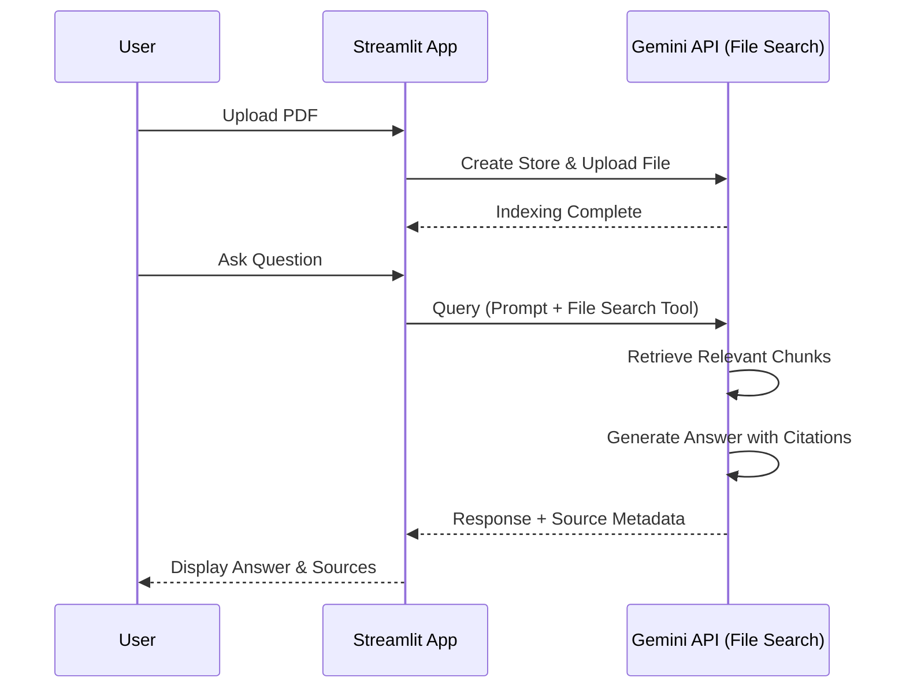

# Gemini PDF Chat

A professional, secure, and efficient tool to interact with your PDF documents using Google's advanced Gemini models. This application leverages the power of **Retrieval-Augmented Generation (RAG)** via the Gemini File Search API to provide accurate, context-aware answers from your uploaded files.

## How It Works

This tool simplifies the complex process of document analysis. Instead of pasting text or worrying about token limits, you simply upload your PDF. We handle the rest using a sophisticated pipeline:

1.  **Secure Upload**: Your file is temporarily staged and securely uploaded to a private Google Gemini File Search store.
2.  **Indexing**: Google's infrastructure processes and indexes the content, making it semantically searchable.
3.  **Retrieval-Augmented Generation (RAG)**: When you ask a question, the system searches your document for relevant sections and provides them to the Gemini model.
4.  **Intelligent Response**: The model synthesizes an answer based *only* on the information found in your document, citing its sources.



## Features

*   **State-of-the-Art Models**: Choose between `gemini-2.5-pro` for deep reasoning or `gemini-2.5-flash` for lightning-fast responses.
*   **Secure by Design**: API keys are stored only in your session. Files and vector stores are automatically cleaned up when you reset or exit.
*   **Transparent Citations**: Every answer comes with a "View Sources" expandable, showing exactly which parts of your document were used.
*   **User-Centric UI**: A clean, responsive interface built with Streamlit, featuring drag-and-drop uploads and chat history.

## Getting Started

### Prerequisites

*   Python 3.10 or higher
*   A [Google Gemini API Key](https://aistudio.google.com/app/apikey)

### Installation

We recommend using `uv` for a fast and reliable setup, but standard `pip` works perfectly too.

**Using `uv` (Recommended):**

```bash
# Install dependencies and run
uv run streamlit run main.py
```

**Using `pip`:**

```bash
# Create virtual environment
python -m venv .venv
source .venv/bin/activate

# Install requirements
pip install -r requirements.txt

# Run the app
streamlit run main.py
```

## Configuration

You can provide your API key directly in the application sidebar for a one-off session. For frequent use, we recommend setting it as an environment variable:

```bash
export GEMINI_API_KEY="your_api_key_here"
```

## Project Structure

The codebase follows a modular, service-oriented architecture designed for scalability and maintainability:

```
.
├── app/
│   ├── core/          # Configuration, state management, and exceptions
│   ├── services/      # External integrations (Gemini API, PDF handling)
│   ├── ui/            # UI components and rendering logic
│   └── utils/         # Helper functions and localization
├── main.py            # Application entry point
└── pyproject.toml     # Project metadata and dependencies
```

---
