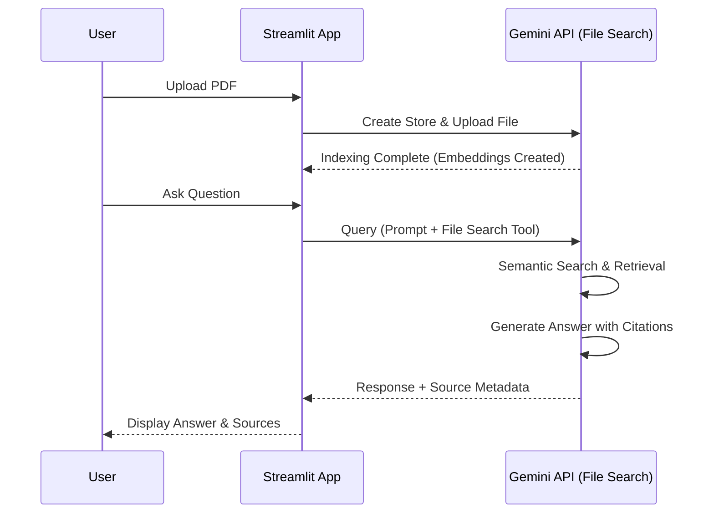

# Gemini API File Search Tool - RAG-as-a-Service

A professional, secure, and efficient tool to interact with your PDF documents using Google's advanced Gemini models. This application leverages the power of **Retrieval-Augmented Generation (RAG)** via the Gemini File Search API to provide accurate, context-aware answers from your uploaded files.

> **Read the full article:** [Revolutionizing RAG: Why Gemini File Search Tool is the great RAG-as-a-Service](https://sabit-shaiholla.github.io/portfolio/gemini-api-file-search-tool/)
>
> **Live Demo:** [https://filequerysystem.duckdns.org/](https://filequerysystem.duckdns.org/)

## How It Works: Semantic Search and Managed Indexing

This tool simplifies the complex process of document analysis by abstracting away the entire retrieval pipeline. Instead of managing vector databases and chunking strategies yourself, the Gemini File Search API handles it all:

1.  **Secure Upload & Indexing**: When you upload a file, it is securely transferred to a private Google Gemini File Search store. The system automatically chunks the document, embeds it using powerful models (like `gemini-embedding-001`), and indexes it for semantic search.
2.  **Semantic Retrieval**: Unlike keyword search, the system understands the deeper meaning of your query. It performs a vector search to find the most relevant document chunks.
3.  **Retrieval-Augmented Generation (RAG)**: The retrieved context is passed to the Gemini model, which synthesizes an answer based *only* on the information found in your document.
4.  **Built-in Verification**: The model's responses include "grounding metadata" (citations), showing exactly which parts of your document were used to generate the answer.



## Key Advantages

### 💰 Unbeatable Pricing Model
The pricing structure addresses major bottlenecks in managed RAG solutions:
*   **Storage is free.**
*   **Query time embeddings are free.**
*   You only pay for embeddings at initial indexing time ($0.15 per 1 million tokens).
*   Retrieved document tokens are charged as regular context tokens.

### 🔄 Flexibility and Management
*   **Persistent Stores**: Unlike temporary file uploads, File Search stores persist indefinitely until you delete them.
*   **Dynamic Updates**: You can progressively add or remove files from an existing knowledge base.
*   **Metadata Filtering**: Apply custom metadata to files for fine-grained control during retrieval (e.g., searching only within specific document subsets).

### ✅ Trust and Verification
*   **Auto-citation**: Built-in citations help prevent hallucinations by pointing users to the exact source text used for the answer.

## Limitations and Considerations

*   **File Size**: Maximum 100 MB per document.
*   **Store Size**: Up to 1 TB (Tier 3), but keeping individual stores under 20 GB is recommended for optimal latency.
*   **Chunk Control**: Limited ability to adjust the number of chunks retrieved.
*   **Supported Models**: Currently supported by `gemini-1.5-pro` and `gemini-1.5-flash` (and newer preview models).

## Features

*   **State-of-the-Art Models**: Support for **Gemini 2.5 Pro Preview** for advanced reasoning, alongside `gemini-2.5-flash`.
*   **Secure by Design**: API keys are stored only in your session. Files and vector stores are automatically cleaned up when you reset or exit.
*   **Transparent Citations**: Every answer comes with a "View Sources" expandable, showing exactly which parts of your document were used.
*   **User-Centric UI**: A clean, responsive interface built with Streamlit, featuring drag-and-drop uploads and chat history.

## Getting Started

### Prerequisites

*   Python 3.10 or higher
*   A [Google Gemini API Key](https://aistudio.google.com/app/apikey)

### Installation

We recommend using `uv` for a fast and reliable setup, but standard `pip` works perfectly too.

**Using `uv` (Recommended):**

```bash
# Install dependencies and run
uv run streamlit run main.py
```

**Using `pip`:**

```bash
# Create virtual environment
python -m venv .venv
source .venv/bin/activate

# Install requirements
pip install -r requirements.txt

# Run the app
streamlit run main.py
```

## Configuration

You can provide your API key directly in the application sidebar for a one-off session. For frequent use, we recommend setting it as an environment variable:

```bash
export GEMINI_API_KEY="your_api_key_here"
```

## Project Structure

The codebase follows a modular, service-oriented architecture designed for scalability and maintainability:

```
.
├── app/
│   ├── core/          # Configuration, state management, and exceptions
│   ├── services/      # External integrations (Gemini API, PDF handling)
│   ├── ui/            # UI components and rendering logic
│   └── utils/         # Helper functions and localization
├── main.py            # Application entry point
└── pyproject.toml     # Project metadata and dependencies
```

---
